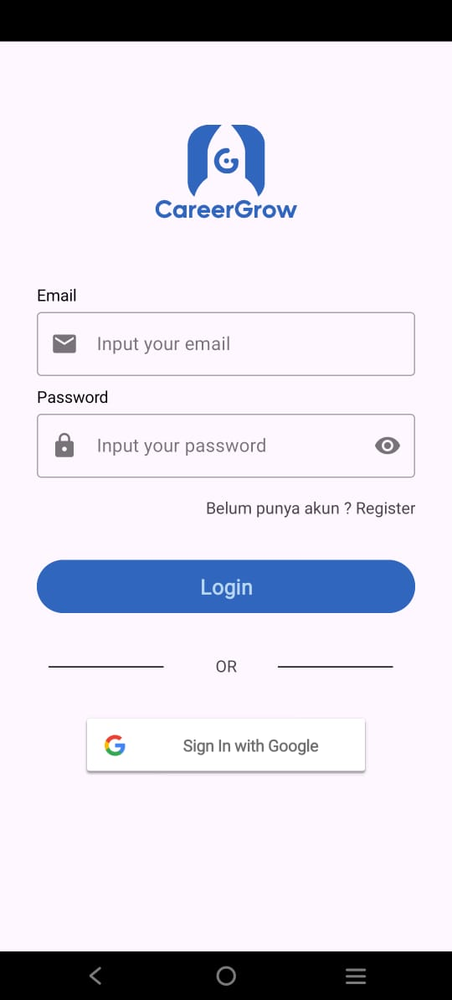
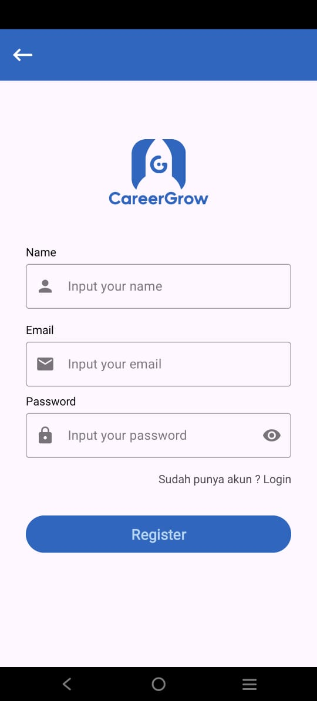
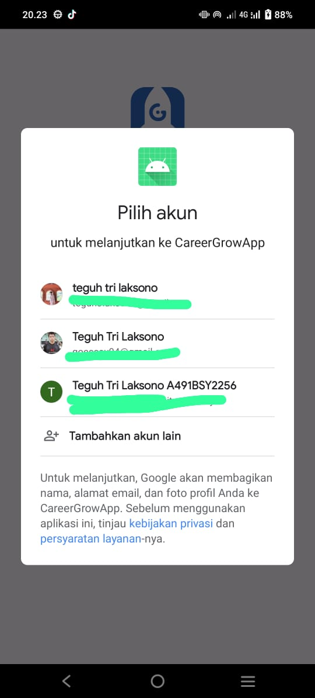
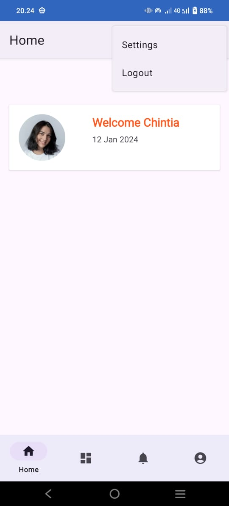

# CareerGrow App
CareerGrow App GitHub Repositories of Hackfest 2024 - NotFoundTeam.
Progress Tracker and Career Preparation for Common Fresh Graduate and Switch Career Employee

# Project Description

   
  
  
  

This project was created to fulfill the task in stage 2 of the hackfest 2024 competition.

## Team : NotFoundTeam
- Hustler : Chintia Agustin
- Hipster : Mevani Karmilah
- Hacker  : Muhammad Faisal Nugroho (backend)
- Hacker  : Teguh Tri Laksono (frontend)

## Tech Stack
- Android Studio
- Kotlin Native Programming Language
- Firebase

## API Documentation
